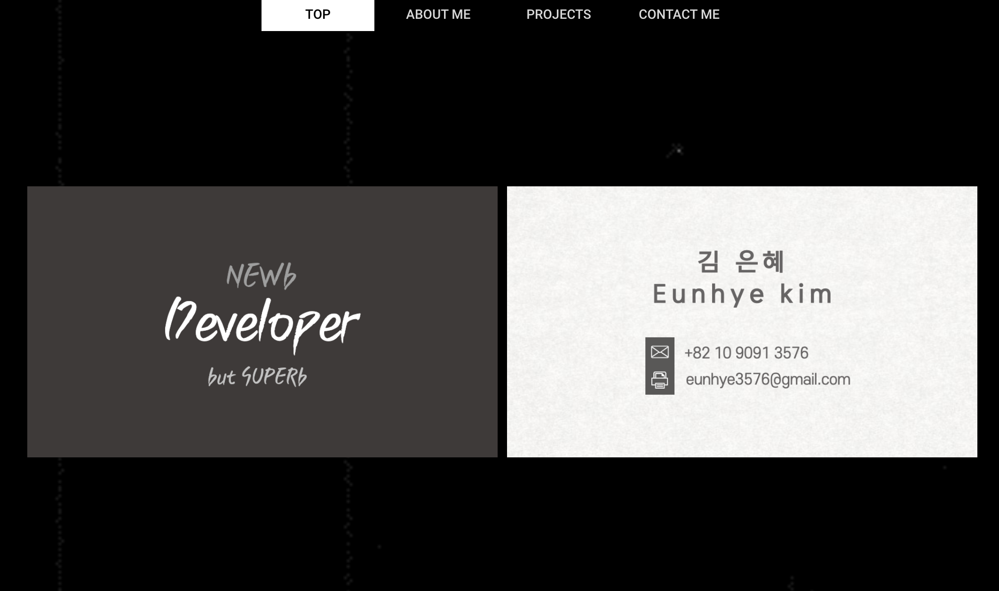
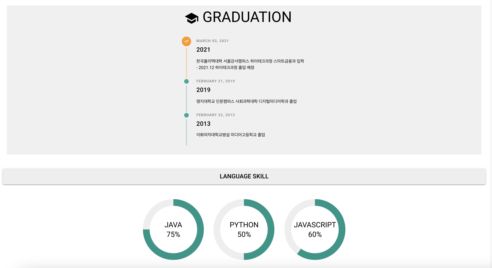
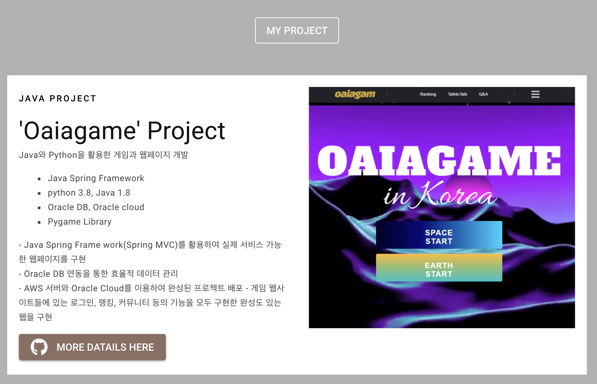
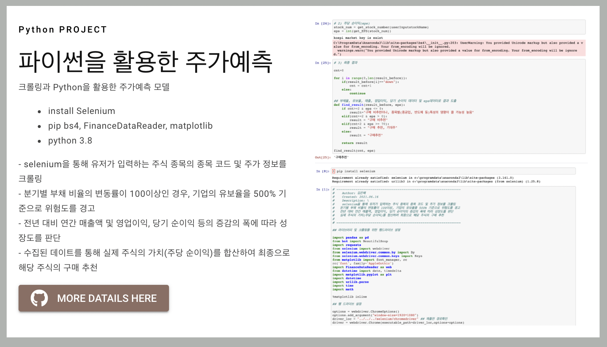
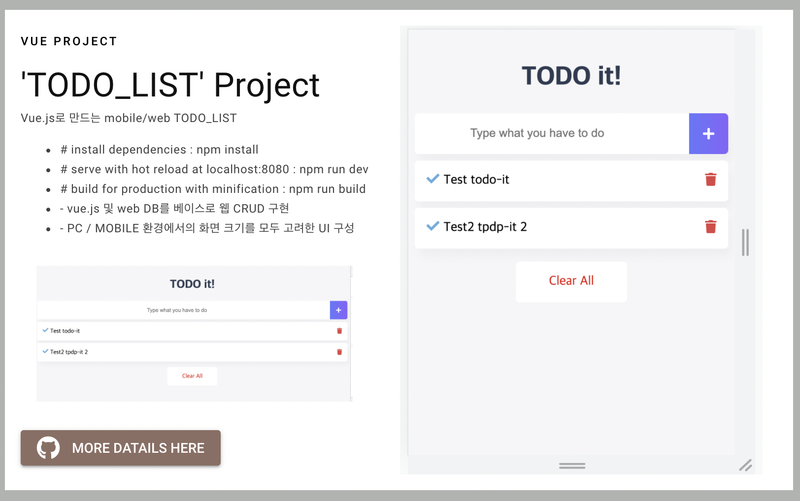

# Profile

* 안녕하세요, 김은혜입니다.
* [Quasar Framework](https://quasar.dev/) & [Vue.js](https://vuejs.org/) 를 이용하여 만든 포트폴리오입니다.

## SITE : [stoic-villani-435777.netlify.app](stoic-villani-435777.netlify.app)

## Screens UI

  

### Customize the configuration
See [Configuring quasar.conf.js](https://quasar.dev/quasar-cli/quasar-conf-js).

## License

[MIT](http://opensource.org/licenses/MIT)

## Original Source (forked from)
https://github.com/mayank091193/mayank-profile
